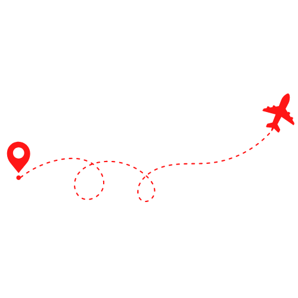
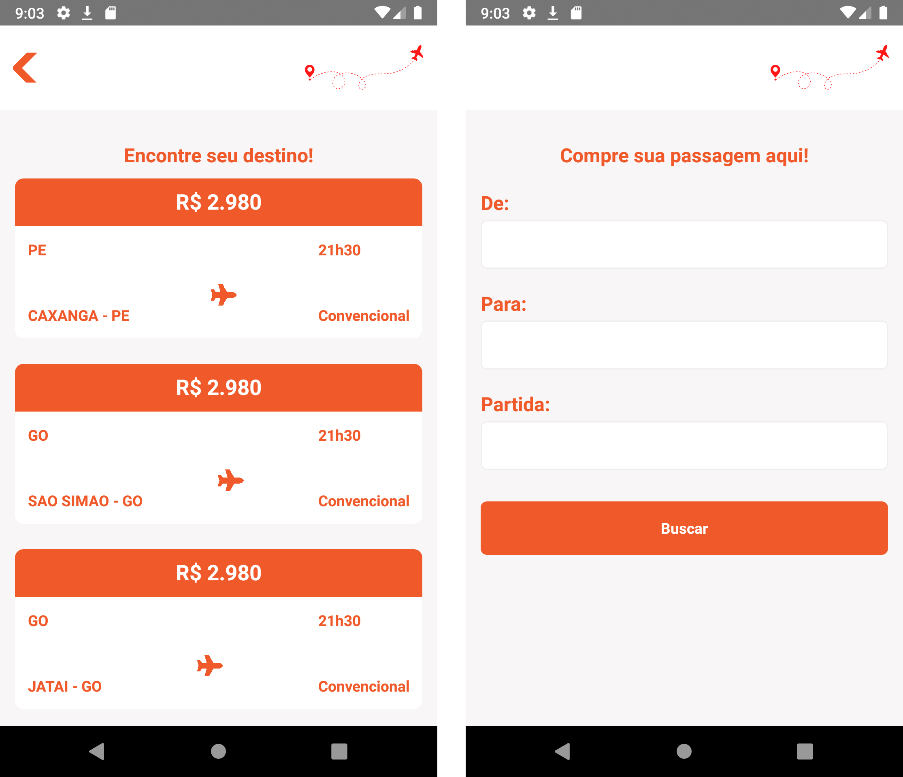

<h1 align="center">
    
</h1>

<h4 align="center">
  🚀 Travel 🚀
</h4>

  

  
  
  

  

  

  <a href="#rocket-tecnologias">Tecnologias</a>&nbsp;&nbsp;&nbsp;|&nbsp;&nbsp;&nbsp;
  <a href="#-projeto">Projeto</a>&nbsp;&nbsp;&nbsp;|&nbsp;&nbsp;&nbsp;
  <a href="#-como-contribuir">Como contribuir</a>&nbsp;&nbsp;&nbsp;|&nbsp;&nbsp;&nbsp;
  <a href="#memo-licença">Licença</a>

 

  

## :rocket: Tecnologias

Esse projeto foi desenvolvido com a seguinte tecnologia:

- [React Native](https://facebook.github.io/react-native/)

## 💻 Projeto

Travel!

- Projeto ainda está em fase de desenvolvimento! Em breve você conseguirá localizar as passagens disponíveis pora a localidade desejada! ✈️

## 🎮 Start

- Passo 1: Utilize o comando `yarn install ou só yarn` para instalar as dependências do projeto;

- Passo 2: Utilize o comando `yarn android` para inicializar o metro bundler e startar o App no seu emulador;

Obs: Caso não tenha seu ambiente configurado para rodar o App [clique aqui](https://reactnative.dev/docs/environment-setup) e acesse a documentação do React Native.

## 🤖 APK

APK ainda não está disponível!😢

## 🤔 Como contribuir

- Faça um fork desse repositório;
- Cria uma branch com a sua feature: `git checkout -b minha-feature`;
- Faça commit das suas alterações: `git commit -m 'feat: Minha nova feature'`;
- Faça push para a sua branch: `git push origin minha-feature`.

Depois que o merge da sua pull request for feito, você pode deletar a sua branch.

## 🤯 Observações

Devido a correria do trabalho não tive muito tempo para finalizar o desafio 100%, mas dei meu melhor e espero que gostem. 😊

## :memo: Licença

Esse projeto está sob a licença MIT. Veja o arquivo [LICENSE](LICENSE.md) para mais detalhes.

---

Feito com ♥ by Daniel Jerônimo :wave: [Entre em contato!](https://www.linkedin.com/in/danielgjl/)
